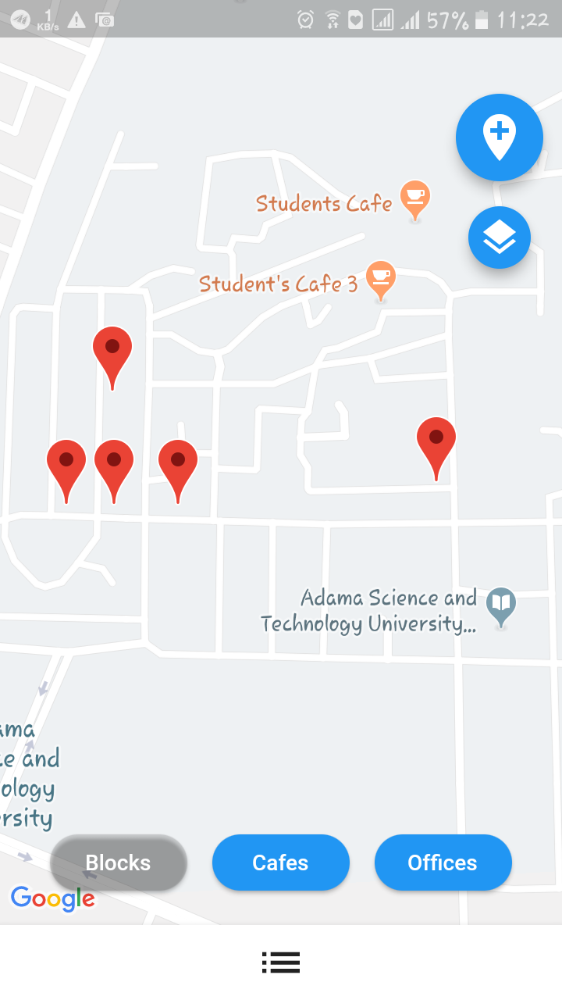
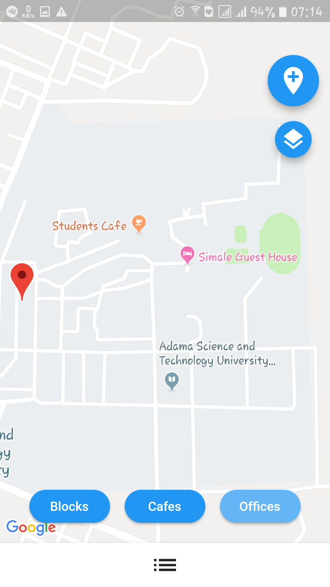
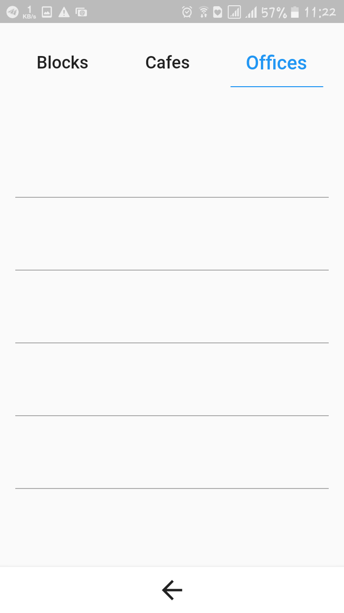
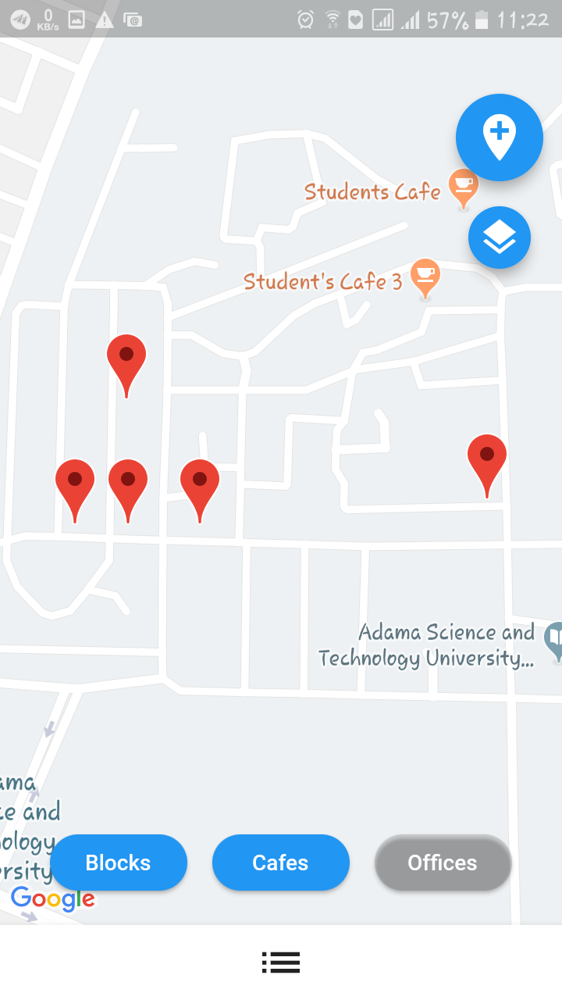
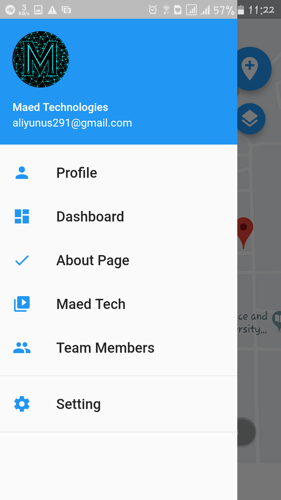
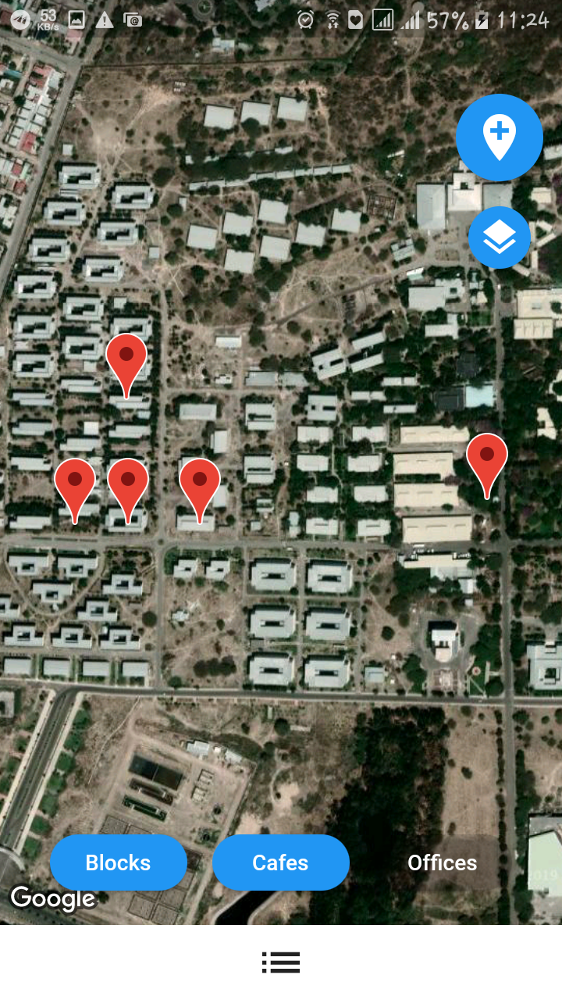
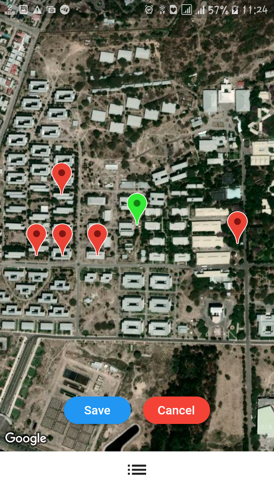

# Astu-Nav
a school project using Flutter and google maps api
a flutter application used to specify the place in Adama science and technology 
### Show some :heart: and :star: the repo to support the project and follow me

| 1.Blocks | 2.Cafes|
|------|-------|
|||

| 3. Offices | 4. Basic info|
|------|-------|
|||

| 5. | 6. Details|
|------|-------|
|||

| 7.Satellite | 8. Add place|
|------|-------|
|||assets/1.png

## Getting Started

This project is a starting point for a Flutter application.

A few resources to get you started if this is your first Flutter project:

- [Lab: Write your first Flutter app](https://flutter.io/docs/get-started/codelab)
- [Cookbook: Useful Flutter samples](https://flutter.io/docs/cookbook)

For help getting started with Flutter, view our 
[online documentation](https://flutter.io/docs), which offers tutorials, 
samples, guidance on mobile development, and a full API reference.
